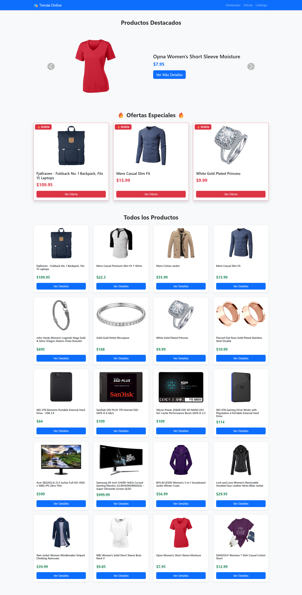

[](https://classroom.github.com/a/lkBk6qgW)
[](https://classroom.github.com/open-in-codespaces?assignment_repo_id=21419353)
# Ejercicio JavaScript - Uso de API y Netlify

Este repositorio contiene dos ejercicios prácticos para aprender a consumir APIs, crear interfaces dinámicas y publicar proyectos web.

## 🎯 Flujo de Trabajo

```
┌─────────────────────────────────────────────────────────────────┐
│  EJERCICIO 7: Crear Tienda Online con API (1.0 punto)          │
│  ─────────────────────────────────────────────────────────      │
│  1. Crear estructura de archivos (docs/)           │
│  2. Implementar funciones JavaScript                           │
│  3. Consumir API de Fake Store                                 │
│  4. Diseñar con Bootstrap 5                                    │
│  5. Ejecutar tests localmente                                  │
│                                                                 │
│  ✅ Resultado: Tienda funcional en tu máquina local            │
└─────────────────────────────────────────────────────────────────┘
                              │
                              ▼
┌─────────────────────────────────────────────────────────────────┐
│  EJERCICIO 8: Publicar en Netlify (1.0 punto)                  │
│  ─────────────────────────────────────────────────────────      │
│  1. Descargar carpeta docs/                                    │
│  2. Crear cuenta en Netlify                                    │
│  3. Desplegar con drag & drop                                  │
│  4. Completar archivo my-page.js                               │
│  5. Push y verificar calificación                              │
│                                                                 │
│  ✅ Resultado: Tienda accesible desde internet 🌐              │
└─────────────────────────────────────────────────────────────────┘
                              │
                              ▼
                   🎉 CALIFICACIÓN TOTAL: 2.0 PUNTOS 🎉
```

## Estructura del Proyecto

```
./
├── ejercicios/          # Instrucciones del ejercicio.
├── docs/               # Archivos de tu solución (aquí crearás tus archivos).
├── tests/              # Pruebas automatizadas (no tocar ni modificar nada).
├── .github/workflows/  # Configuración de GitHub Actions (no tocar ni modificar nada).
└── package.json        # Dependencias para las pruebas (no tocar ni modificar nada).
```

## Resultado Final Esperado 



---

## 📚 Ejercicios

Este repositorio contiene dos ejercicios relacionados:

### Ejercicio 7: Uso de API - JSON (1.0 punto)
Crear una tienda online que consume datos de una API REST.

### Ejercicio 8: Publicación en Netlify (1.0 punto)
Publicar el proyecto del ejercicio 7 en Netlify.

**Calificación Total: 2.0 puntos**

---

## Ejercicio 7: Uso de API - JSON

### Objetivo
Conocer e implementar las consultas a una API. Crear un entorno de frontend para consultar y mostrar datos provenientes desde una API.

### Descripción del Proyecto
Vamos a realizar un **catálogo de tienda online** utilizando la API de [Fake Store API](https://fakestoreapi.com/) que nos proporcionará los datos necesarios para mostrar información a los visitantes.

### Conceptos Cubiertos
- Consumo de APIs REST
- Fetch API y Promesas
- Async/Await
- Manipulación del DOM
- Bootstrap 5 (Cards, Carousel, Modal, Grid)
- Diseño responsivo
- Interactividad con JavaScript

## Ejecución de Pruebas

Para verificar tu progreso, ejecuta las pruebas:

```bash
# Instalar dependencias (primera vez)
npm install

# Ejecutar las pruebas del ejercicio 7
npm test -- --testPathPattern="7-api-json.test.js"

# O ejecutar todas las pruebas
npm test
```

## Instrucciones Detalladas

- 📖 **Tutorial Completo**: `ejercicios/ejercicio-7-api-json.md` - Incluye tutorial guiado paso a paso
- ⚡ **Guía Rápida**: `GUIA-RAPIDA.md` - Checklist, snippets y referencia rápida

Consulta estos archivos para las instrucciones completas y detalladas del ejercicio.

## Pasos Sugeridos

1. **Fase 0: Tutorial Guiado** ⭐ **¡EMPIEZA AQUÍ!**
   - Lee el tutorial paso a paso en `ejercicios/ejercicio-7-api-json.md`
   - Aprende a construir la función `obtenerProductos()` siguiendo el tutorial
   - Entiende los conceptos de async/await, fetch y manejo de errores

2. **Fase 1: Preparación**
   - Crea la estructura de carpetas: `docs/`, `js/`, `css/`
   - Lee la documentación de la API
   - Crea los archivos básicos: `index.html`, `js/api-store.js`
   - Incluye Bootstrap 5 en tu HTML

3. **Fase 2: Obtener Datos**
   - Implementa la función `obtenerProductos()` usando el tutorial como guía
   - Verifica en la consola que los datos se obtienen correctamente

4. **Fase 3: Catálogo Completo**
   - Implementa `mostrarCatalogo()`
   - Muestra todos los productos en cards de Bootstrap

5. **Fase 4: Ofertas**
   - Implementa `mostrarOfertas()`
   - Filtra y muestra los productos 1, 4 y 7

6. **Fase 5: Carrusel**
   - Implementa `mostrarCarrusel()`
   - Selecciona 3 productos al azar

7. **Fase 6: Modal de Detalles**
   - Implementa `mostrarDetalles()`
   - Crea el modal con todos los datos del producto

8. **Fase 7: Pruebas**
   - Ejecuta las pruebas automatizadas
   - Corrige los errores que aparezcan

## Consejos Importantes

- **Debugging**: Usa `console.log()` para ver los datos que recibes de la API
- **Consola del navegador**: Es tu mejor amiga para detectar errores
- **Bootstrap**: Revisa la documentación oficial para los componentes
- **Paso a paso**: No intentes hacer todo de una vez
- **Pruebas frecuentes**: Ejecuta los tests regularmente para ver tu progreso

## Criterios de Evaluación

Las pruebas automáticas verificarán:
- ✅ Estructura correcta del HTML
- ✅ Inclusión de Bootstrap 5
- ✅ Existencia de todos los elementos requeridos
- ✅ Definición de todas las funciones JavaScript
- ✅ Uso correcto de Fetch API
- ✅ Manipulación del DOM
- ✅ Manejo de errores
- ✅ Uso de componentes Bootstrap (Cards, Carousel, Modal)

### 📊 Sistema de Calificación (Total: 2.0 puntos)

El sistema de autograding asigna puntos de forma **parcial y progresiva**:

#### Ejercicio 7: Tienda Online con API (1.0 punto)

| Grupo de Tests | Puntos | Descripción |
|---|---|---|
| **Grupo 1**: Estructura HTML | 0.25 pts | Elementos HTML, Bootstrap incluido, IDs correctos |
| **Grupo 2**: Funciones JavaScript | 0.25 pts | Definición de todas las funciones requeridas |
| **Grupo 3**: Uso de Fetch API | 0.25 pts | Implementación correcta de fetch, async/await |
| **Grupo 4**: Inicialización | 0.15 pts | Event listeners, código de inicialización |
| **Grupo 5**: Bootstrap | 0.25 pts | Uso correcto de componentes Bootstrap |
| **Grupo 6**: Buenas Prácticas | 0.25 pts | Manejo de errores, uso de const/let |
| **Grupo 7**: Contenido Dinámico | 0.25 pts | Manipulación DOM, iteración de arrays |
| **Bonus Ejercicio 7**: Todos los tests | 0.35 pts | Si pasan TODOS los tests del ejercicio 7 |

**Subtotal Ejercicio 7:** 1.0 punto (0.65 base + 0.35 bonus)

#### Ejercicio 8: Publicación en Netlify (1.0 punto)

| Grupo de Tests | Puntos | Descripción |
|---|---|---|
| **Test 8.1**: Archivo my-page.js | 0.15 pts | Existe archivo con datos válidos |
| **Test 8.2**: Nombre válido | 0.10 pts | Campo name con nombre completo |
| **Test 8.3**: Matrícula válida | 0.10 pts | Campo matricula sin guiones |
| **Test 8.4**: URL válida | 0.15 pts | URL de Netlify con formato correcto |
| **Test 8.5**: Sitio accesible | 0.20 pts | Sitio accesible y retorna código 200 |
| **Test 8.6**: Contenido HTML | 0.15 pts | HTML con elementos correctos |
| **Test 8.7**: JavaScript | 0.10 pts | Archivo JS incluido en el sitio |
| **Test 8.8**: Estructura | 0.05 pts | Archivos en ubicaciones correctas |

**Subtotal Ejercicio 8:** 1.0 punto

---

**🎯 Total: 2.0 puntos** (Ejercicio 7: 1.0 + Ejercicio 8: 1.0)

**¿Cómo funciona?**
- ✅ Cada grupo de tests que pases suma puntos a tu calificación
- 📈 Puedes obtener calificación parcial en cada ejercicio
- 🎯 Completa ambos ejercicios para obtener los 2.0 puntos
- 🔄 Puedes hacer múltiples intentos para mejorar tu calificación

---

## Ejercicio 8: Publicación en Netlify

### Objetivo
Aprender a desplegar y publicar tu proyecto web en Netlify para que esté disponible públicamente en internet.

### Archivos Requeridos

1. **`my-page.js`** (en la raíz del repositorio)
   - Contenido: Objeto con tus datos personales y URL de Netlify
   - Ejemplo:
   ```javascript
   data = {
       name: "Tu Nombre Completo",
       matricula: "TuMatriculaSinGuiones",
       url: "https://tu-sitio.netlify.app/"
   }
   ```

### Pasos Requeridos

1. **Descargar la carpeta `docs/`** a tu computadora local
2. **Crear cuenta en Netlify** (gratis en https://www.netlify.com)
3. **Desplegar con drag & drop** arrastrando la carpeta `docs/` a Netlify
4. **Completar archivo `my-page.js`** con tus datos personales y URL de Netlify
5. **Push de cambios** y verificar calificación automática

### Conceptos Cubiertos
- Netlify hosting
- Despliegue manual de sitios estáticos
- Drag & drop deployment
- URLs públicas
- Hosting gratuito con CDN

### 🚀 Pasos Rápidos:

1. **Descargar carpeta `docs/`:**
   - En VS Code: Clic derecho en `docs/` > Download
   - O desde terminal: `zip -r docs.zip docs/`

2. **Ir a Netlify y desplegar:**
   - Inicia sesión en https://app.netlify.com
   - Arrastra la carpeta `docs/` al área de despliegue
   - Espera 10-30 segundos

3. **Completar `my-page.js`:**
   ```javascript
   data = {
       name: "Tu Nombre Completo",
       matricula: "TuMatriculaSinGuiones",
       url: "https://tu-sitio.netlify.app/"
   }
   ```

4. **Guardar cambios:**
   ```bash
   git add my-page.js
   git commit -m "Registrar datos de Netlify"
   git push origin main
   ```

📖 **Guía Completa**: `ejercicios/ejercicio-8-publish-pages.md`

---

## Recursos Útiles

### APIs y Fetch
- [Fake Store API](https://fakestoreapi.com/)
- [MDN: Fetch API](https://developer.mozilla.org/es/docs/Web/API/Fetch_API)
- [MDN: Usando Fetch](https://developer.mozilla.org/es/docs/Web/API/Fetch_API/Using_Fetch)
- [MDN: Async/Await](https://developer.mozilla.org/es/docs/Web/JavaScript/Reference/Statements/async_function)
- [MDN: Promesas](https://developer.mozilla.org/es/docs/Web/JavaScript/Reference/Global_Objects/Promise)

### Bootstrap 5
- [Bootstrap 5 Documentation](https://getbootstrap.com/docs/5.0/)
- [Bootstrap Cards](https://getbootstrap.com/docs/5.0/components/card/)
- [Bootstrap Carousel](https://getbootstrap.com/docs/5.0/components/carousel/)
- [Bootstrap Modal](https://getbootstrap.com/docs/5.0/components/modal/)
- [Bootstrap Grid System](https://getbootstrap.com/docs/5.0/layout/grid/)

### JavaScript
- [MDN JavaScript Guide](https://developer.mozilla.org/es/docs/Web/JavaScript/Guide)
- [JavaScript.info](https://javascript.info/)

### Netlify
- [Netlify Documentation](https://docs.netlify.com/)
- [Netlify Drop](https://app.netlify.com/drop) - Despliegue rápido
- [Netlify Community](https://answers.netlify.com/)

---

## ⚠️ Importante

- **NO modifiques** los archivos en la carpeta `tests/`
- **NO modifiques** los archivos en `.github/workflows/`
- **NO modifiques** el archivo `package.json`
- Crea tus archivos únicamente en la carpeta `docs/`

---

¡Buena suerte y diviértete creando tu tienda online! 🚀🛍️
