# Ejercicio 7: Uso de API - JSON

## Objetivo
Conocer e implementar las consultas a una API. Crear entorno de frontend para consultar y mostrar datos provenientes desde una API.

## Descripción del Proyecto
Vamos a realizar un catálogo de una tienda online utilizando una API que nos proporcionará los datos necesarios para mostrar las informaciones a los visitantes.

## Resultado Final Esperado 


### Archivos a crear
Debes crear los siguientes archivos en la carpeta `docs/`:

```
docs/
├── index.html          # Interfaz de usuario principal
├── js/
│   └── api-store.js   # Lógica de la aplicación
└── css/
    └── api-store.css  # Estilos personalizados (opcional)
```

### Requisitos del Proyecto

1. **Revisar la API**
   - Documentación: https://fakestoreapi.com/
   - Familiarízate con los endpoints disponibles

2. **Sección de Productos (Catálogo)**
   - Mostrar un listado de todos los productos
   - Cada producto debe mostrar: título, imagen y precio
   - Al hacer clic, mostrar detalles completos en un modal

3. **Sección de Ofertas**
   - Mostrar únicamente 3 productos específicos: el 1º, 4º y 7º
   - Destacar visualmente que son ofertas

4. **Carrusel de Productos**
   - Crear un carrusel con 3 productos seleccionados al azar
   - Mostrar imagen y título
   - Incluir botón para ver más detalles

5. **Modal de Detalles**
   - Al hacer clic en un producto, mostrar todos sus detalles:
     - Imagen grande
     - Título completo
     - Descripción
     - Precio
     - Categoría
     - Rating (calificación)

6. **Tecnologías Requeridas**
   - **Bootstrap 5** para la interfaz de usuario
   - **Fetch API** para obtener los datos
   - **JavaScript moderno** (ES6+)

### Funciones JavaScript Requeridas

Tu archivo `js/api-store.js` debe incluir las siguientes funciones:

- `obtenerProductos()` - Obtiene todos los productos de la API
- `mostrarCatalogo(productos)` - Renderiza todos los productos
- `mostrarOfertas(productos)` - Muestra los 3 productos en oferta
- `mostrarCarrusel(productos)` - Crea el carrusel con productos aleatorios
- `mostrarDetalles(idProducto)` - Muestra el modal con detalles del producto
- Código de inicialización que se ejecute al cargar la página
---

## 📚 Tutorial Guiado: Construyendo la función `obtenerProductos()`

Antes de comenzar con todo el ejercicio, vamos a construir juntos paso a paso la primera función importante: **`obtenerProductos()`**. Esta función será la base para obtener todos los datos de la API.

### 🎯 ¿Qué hace esta función?

La función `obtenerProductos()` se conecta a la API de Fake Store y obtiene todos los productos disponibles. Es como pedirle a la tienda online que nos envíe su catálogo completo.

### 📝 Paso a paso: Construyendo `obtenerProductos()`

#### Paso 1: Entender qué es una API

Una **API** (Application Programming Interface) es como un mesero en un restaurante:
- Tú (el cliente/frontend) le pides algo al mesero (API)
- El mesero va a la cocina (servidor/base de datos)
- El mesero te trae lo que pediste (datos en formato JSON)

En nuestro caso:
- **URL de la API**: `https://fakestoreapi.com/products`
- **Lo que obtendremos**: Un array (lista) de productos en formato JSON

#### Paso 2: Definir la función

Primero, creamos una función **asíncrona** porque obtener datos de internet toma tiempo:

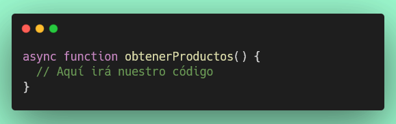

**¿Por qué `async`?**
- Porque vamos a usar `await` para esperar la respuesta de la API
- Las operaciones de red (como fetch) son asíncronas

#### Paso 3: Manejar errores con try-catch

Cuando trabajamos con APIs, pueden ocurrir errores (internet lento, API caída, etc.). Por eso usamos `try-catch`:


#### Paso 4: Usar fetch para obtener los datos

`fetch()` es la función de JavaScript para hacer peticiones HTTP:

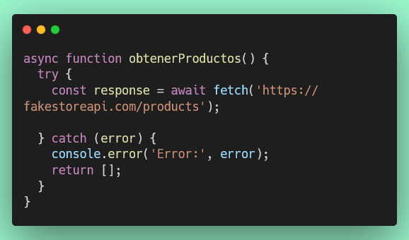

**¿Qué hace `fetch()`?**
- Envía una petición a la URL especificada
- Retorna una **Promesa** que se resuelve con un objeto `Response`
- `await` espera a que la promesa se resuelva antes de continuar

#### Paso 5: Verificar que la respuesta sea exitosa

No basta con recibir una respuesta, debemos verificar que sea exitosa (código 200):

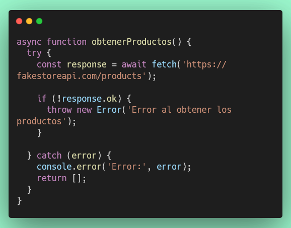

**¿Qué es `response.ok`?**
- Es `true` si el código de estado HTTP está entre 200-299
- Es `false` si hay un error (404, 500, etc.)

#### Paso 6: Convertir la respuesta a JSON

La respuesta viene como texto, necesitamos convertirla a JSON (objeto JavaScript):

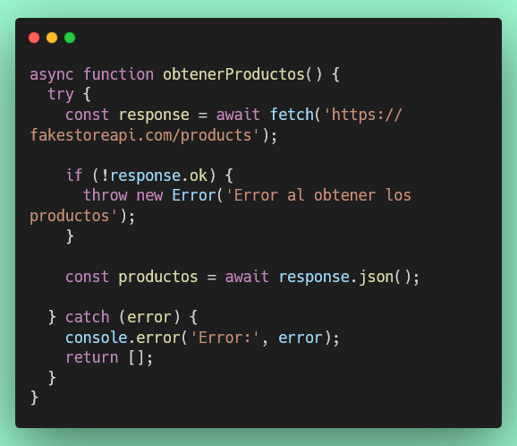

**¿Qué hace `.json()`?**
- Convierte el texto de la respuesta en un objeto JavaScript
- También retorna una Promesa, por eso usamos `await`

#### Paso 7: Retornar los productos

Finalmente, retornamos los productos obtenidos:

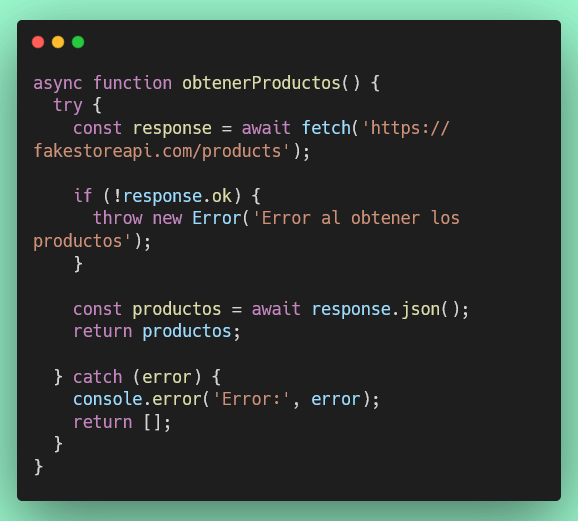

### ✅ Función completa

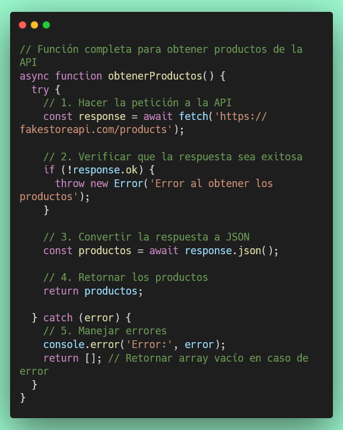

### 🧪 Probando la función

Para probar que funciona, puedes agregar este código temporalmente:

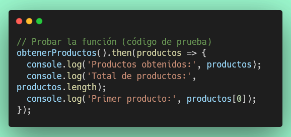

**Lo que verás en la consola:**
- Un array con 20 productos
- Cada producto tiene: id, title, price, description, category, image, rating

### 🎓 Conceptos clave que aprendiste

1. **async/await**: Para manejar operaciones asíncronas de forma más legible
2. **fetch()**: Para hacer peticiones HTTP a APIs
3. **try-catch**: Para manejar errores de forma apropiada
4. **response.ok**: Para verificar respuestas exitosas
5. **.json()**: Para convertir respuestas a objetos JavaScript
6. **return**: Para devolver los datos obtenidos

### 💡 Consejos importantes

- Siempre usa `try-catch` cuando trabajes con APIs
- Siempre verifica `response.ok` antes de procesar la respuesta
- Retorna un valor por defecto (como `[]`) en caso de error
- Usa `console.log()` para debuggear y ver qué datos recibes

### 🚀 Siguiente paso

Ahora que entiendes cómo funciona `obtenerProductos()`, puedes aplicar conceptos similares para:
- `mostrarCatalogo()`: Recorrer el array de productos y crear HTML
- `mostrarOfertas()`: Filtrar productos específicos del array
- `mostrarCarrusel()`: Seleccionar productos aleatorios
- `mostrarDetalles()`: Hacer fetch a un producto específico por ID

¡Sigamos con el resto del ejercicio!

---

## Instrucciones

Crea los siguientes archivos en la carpeta `docs/`:

```
docs/
├── index.html          # Archivo principal HTML
├── js/
│   └── api-store.js   # Lógica de la aplicación
└── css/
    └── api-store.css  # Estilos personalizados (opcional)
```

### Paso 1: Revisar la API
1. Revisa la documentación de la siguiente API: [https://fakestoreapi.com/](https://fakestoreapi.com/)
2. Familiarízate con los endpoints disponibles, especialmente:
   - `GET /products` - Obtener todos los productos
   - `GET /products/{id}` - Obtener un producto específico

### Paso 2: Crear la Interfaz de Usuario (UI)

#### Requisitos del HTML (`index.html`)

Crea un documento HTML que incluya:

1. **Head**:
   - Título apropiado
   - Bootstrap 5 CDN (CSS y JS)
   - Enlace a `api-store.css` (opcional)
   - Enlace a `api-store.js`

2. **Body** con las siguientes secciones:
   - **Header/Navbar**: con el nombre de la tienda
   - **Sección de Ofertas** (`id="ofertas"`): para mostrar productos en oferta
   - **Carrusel** (`id="carrusel"`): para mostrar productos aleatorios
   - **Catálogo de Productos** (`id="catalogo"`): para mostrar todos los productos
   - **Modal**: para mostrar detalles del producto seleccionado

3. **Estructura requerida**:
   ```html
   - Navbar de Bootstrap
   - Contenedor principal con:
     - Sección de ofertas (div con id="ofertas")
     - Carrusel de Bootstrap (div con id="carrusel")
     - Sección de catálogo (div con id="catalogo")
   - Modal de Bootstrap para detalles del producto
   ```

> **Nota importante**: Los archivos JavaScript deben estar en la carpeta `js/` y los CSS en `css/`

# Como ver el proyecto
## Usar Live Server

### Si tienes la extensión Live Server instalada:

1. Abre el archivo `docs/index.html` en VS Code
2. Clic derecho en el archivo
3. Selecciona "Open with Live Server"
4. Tu navegador se abrirá automáticamente mostrando la tienda

#### Requisitos del JavaScript (`js/api-store.js`)

Debes implementar las siguientes funcionalidades:

##### 1. Función `obtenerProductos()`
- Debe realizar un fetch a `https://fakestoreapi.com/products`
- Debe retornar una promesa con los datos de los productos
- Debe manejar errores con try-catch

##### 2. Función `mostrarCatalogo(productos)`
- Recibe un array de productos
- Renderiza todos los productos en el elemento con `id="catalogo"`
- Cada producto debe mostrar:
  - Imagen
  - Título
  - Precio
  - Botón o enlace para ver detalles
- Debe usar Bootstrap cards para la presentación

##### 3. Función `mostrarOfertas(productos)`
- Recibe un array de productos
- Muestra únicamente los productos con índice 0, 3 y 6 (productos 1, 4 y 7)
- Renderiza en el elemento con `id="ofertas"`
- Cada producto debe mostrar:
  - Imagen
  - Título
  - Precio
  - Badge o etiqueta de "Oferta"
  - Botón para ver detalles

##### 4. Función `mostrarCarrusel(productos)`
- Recibe un array de productos
- Selecciona 3 productos al azar
- Crea un carrusel de Bootstrap en el elemento con `id="carrusel"`
- Cada slide debe mostrar:
  - Imagen del producto
  - Título
  - Botón para ver más detalles

##### 5. Función `mostrarDetalles(idProducto)`
- Recibe el ID de un producto
- Realiza un fetch a `https://fakestoreapi.com/products/{idProducto}`
- Muestra un modal de Bootstrap con todos los detalles:
  - Imagen grande
  - Título
  - Descripción completa
  - Precio
  - Categoría
  - Rating (calificación)

##### 6. Función `inicializar()` o código de inicialización
- Debe ejecutarse cuando el DOM esté cargado
- Llama a `obtenerProductos()`
- Con los productos obtenidos, llama a:
  - `mostrarCatalogo()`
  - `mostrarOfertas()`
  - `mostrarCarrusel()`

### Requisitos Técnicos

1. **Uso de API**:
   - Utilizar `fetch()` para las peticiones HTTP
   - Manejar promesas con `async/await` o `.then()/.catch()`
   - Manejar errores apropiadamente

2. **Bootstrap 5**:
   - Utilizar componentes de Bootstrap:
     - Cards para productos
     - Carousel para el carrusel
     - Modal para detalles
     - Grid system (row/col) para layout responsivo
     - Badges para etiquetas de oferta
     - Navbar para la cabecera

3. **Interactividad**:
   - Los productos deben ser clickeables para ver detalles
   - El modal debe abrirse y cerrarse correctamente
   - El carrusel debe ser funcional con controles

4. **Diseño Responsivo**:
   - El diseño debe adaptarse a diferentes tamaños de pantalla
   - Usar clases de Bootstrap para responsividad

## Estructura Sugerida del Catálogo

```
┌─────────────────────────────────────┐
│         Navbar (Tienda)             │
├─────────────────────────────────────┤
│      Carrusel (3 productos)         │
├─────────────────────────────────────┤
│    Ofertas Especiales (3 items)     │
│   [Producto 1] [Producto 4] [Prod 7]│
├─────────────────────────────────────┤
│          Todos los Productos        │
│   [P] [P] [P] [P]                   │
│   [P] [P] [P] [P]                   │
│   [P] [P] [P] [P]                   │
└─────────────────────────────────────┘
```

## Conceptos Clave

### API y JSON
- **API (Application Programming Interface)**: Interfaz que permite la comunicación entre aplicaciones
- **JSON (JavaScript Object Notation)**: Formato de intercambio de datos
- **Endpoints**: URLs específicas de una API que proporcionan diferentes datos

### Fetch API

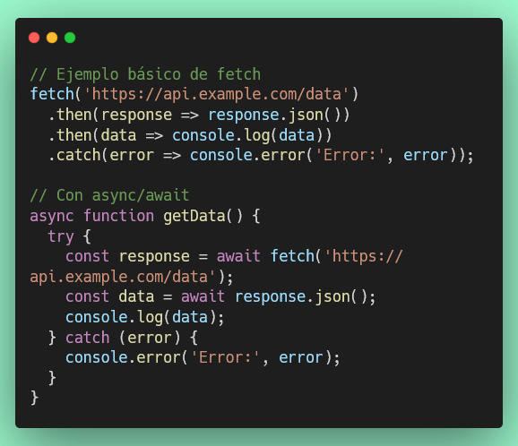

### Bootstrap 5 - Componentes Útiles

**Card:**
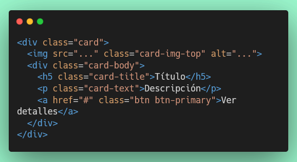

**Modal:**

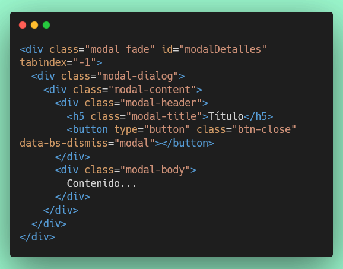

**Carousel:**

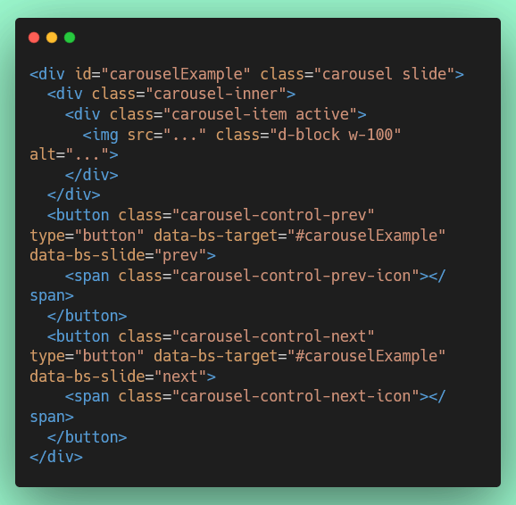

## Consejos

1. **Comienza paso a paso**:
   - Primero obtén los datos de la API
   - Luego implementa el catálogo completo
   - Después las ofertas
   - Luego el carrusel
   - Finalmente el modal de detalles

2. **Debugging**:
   - Usa `console.log()` para verificar los datos recibidos
   - Revisa la consola del navegador para errores
   - Usa las DevTools para inspeccionar elementos

3. **Testing manual**:
   - Verifica que todos los productos se muestren
   - Comprueba que el modal funcione
   - Asegúrate de que el carrusel sea aleatorio
   - Confirma que las ofertas sean los productos correctos

## Validación

Ejecuta las pruebas con:
```bash
npm test -- --testPathPattern="7-api-json.test.js"
```

## Recursos
- [Fake Store API](https://fakestoreapi.com/)
- [MDN: Fetch API](https://developer.mozilla.org/es/docs/Web/API/Fetch_API)
- [MDN: Async/Await](https://developer.mozilla.org/es/docs/Web/JavaScript/Reference/Statements/async_function)
- [Bootstrap 5 Documentation](https://getbootstrap.com/docs/5.0/getting-started/introduction/)
- [Bootstrap Cards](https://getbootstrap.com/docs/5.0/components/card/)
- [Bootstrap Carousel](https://getbootstrap.com/docs/5.0/components/carousel/)
- [Bootstrap Modal](https://getbootstrap.com/docs/5.0/components/modal/)
